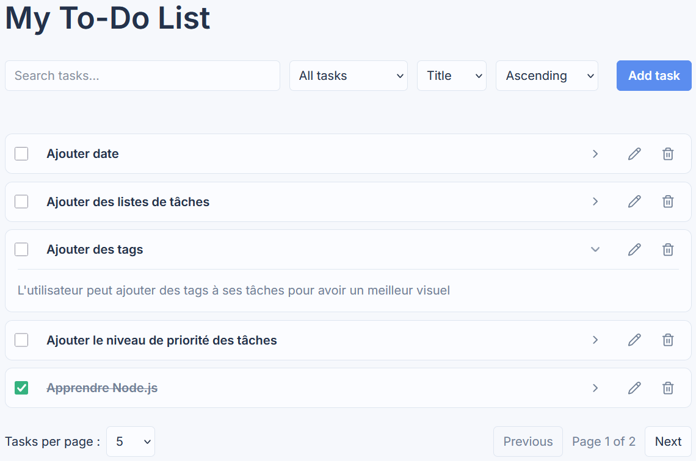
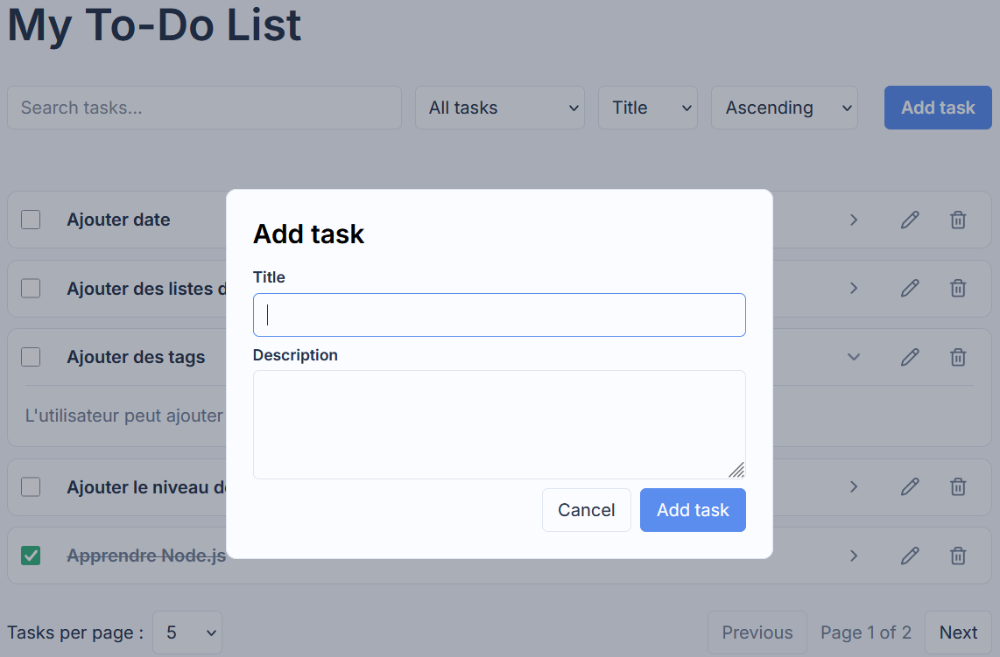

# Todo List – Full Stack Application

Application web de gestion de tâches développée dans le cadre de mon apprentissage du développement Full Stack JavaScript.

## Aperçu





## Fonctionnalités

* Affichage des tâches
* Création d'une tâche
* Modification d'une tâche
* Suppression d'une tâche
* Modification du statut d'une tâche (terminée / non terminée)
* Persistance des données en base PostgreSQL

## Technologies

### Front-end

* React
* JavaScript
* HTML
* CSS

### Back-end

* Node.js
* Express
* API REST

### Base de données

* PostgreSQL

### Outils

* Git
* VS Code

## Architecture

Le projet est composé de deux parties :

* `frontend` : interface utilisateur développée avec React
* `backend` : API REST développée avec Node.js et Express
* PostgreSQL : stockage persistant des tâches

Le front-end communique avec le back-end via des requêtes HTTP vers l'API REST.

## Installation

### Prérequis

* Node.js
* PostgreSQL

### Front-end

```bash
cd frontend
npm install
npm run dev
```

### Back-end

```bash
cd backend
npm install
node server.js
```

### Base de données

Le projet utilise **PostgreSQL** pour assurer la persistance des tâches.

#### 1. Créer la base de données

Créer une base de données PostgreSQL nommée :

```sql
CREATE DATABASE todo_app;
```

Puis créer la table `tasks` :

```sql
CREATE TABLE tasks (
    id UUID PRIMARY KEY DEFAULT gen_random_uuid(),
    title TEXT NOT NULL,
    description TEXT,
    completed BOOLEAN NOT NULL DEFAULT false
);
```

#### 2. Configurer les variables d'environnement

Le fichier `.env` contenant les informations de connexion à PostgreSQL n'est pas versionné sur GitHub.

Créer un fichier `.env` dans le dossier `backend` et renseigner les variables utilisées dans `database.js` :

```env
DB_USER=postgres
DB_HOST=localhost
DB_NAME=todo_app
DB_PASSWORD=votre_mot_de_passe
DB_PORT=5432
```

Les valeurs doivent être adaptées à votre installation PostgreSQL.

#### 3. Installer les dépendances et lancer le serveur

```bash
cd backend
npm install
node server.js
```

L'API sera disponible sur :

```text
http://localhost:3000
```


## Objectif

Ce projet m'a permis de mettre en pratique le développement d'une application Full Stack avec React, Node.js, Express et PostgreSQL, ainsi que la communication entre un front-end et une API REST.
